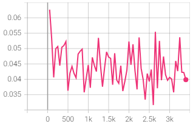
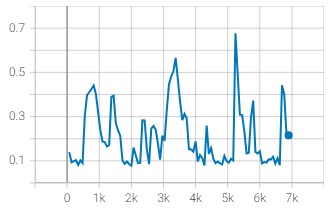

# Normal Map Generator

## Methodology
* Creation of a working model which uses a Unet architecture on PyTorch with PyTorch Lightning and plot results on Tensorboard.
  * The model is a simple Unet architecture, with encoder / decoder. The decoder uses upsampling and convolutional layers to avoid the checkerboard effect.
  * Data augmentation is used (random flip, random crop)
* Tested different models parameters
  * Initial channel is 64, tested with 32 and 128
* Added a discriminator
* Added data normalization (-1, 1)

## Results

All models except the larger model were trained for 100 epochs.

| Iteration   | Train loss  | Val Loss   | Generated Results   |   
|---|---|---|---|
| Ground Truth  |     |     |    |   
| Initial Model  |    |    |    |   
| Smaller model (initial channel at 32)  |    |    |    |   
| Larger model (initial channel at 64)  |    |    |    |   
| Add Discriminator  |    |    |    |   
| Normalize data between -1 and 1  |    |    |    |   